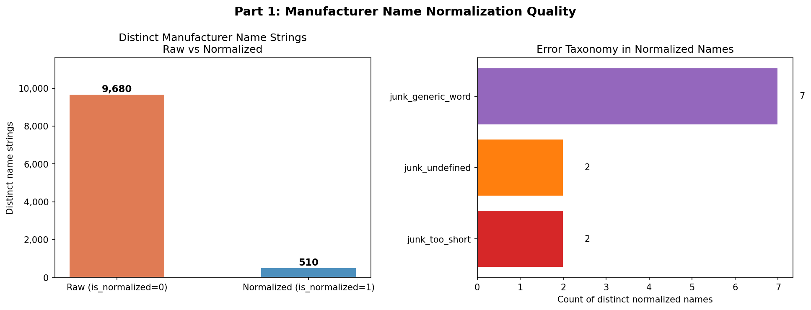
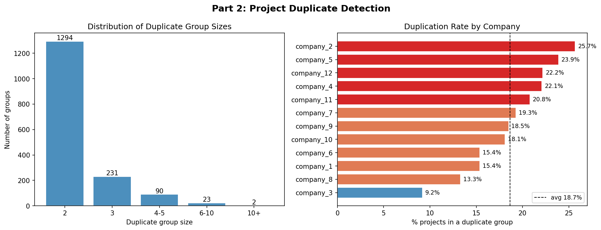
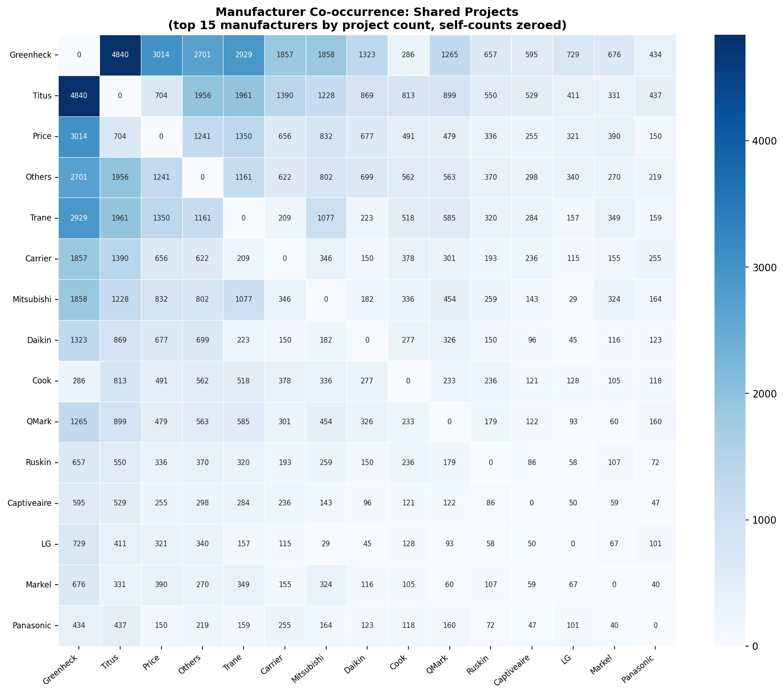

# Rebar DAE Take-Home Case Study

**Candidate:** Prashanth Talwar
**Date:** April 2026

---

## Overview

This submission analyzes the Rebar construction analytics database (`candidate_database.sqlite`) across three parts: manufacturer entity resolution, project duplicate detection, and exploratory market analysis. All analysis is contained in a single Jupyter notebook.

---

## Repository Structure

```
C:/Rebar/
    analysis.ipynb                     # Main analysis notebook
    SUBMISSION_README.md               # How to run instructions
    part1_normalization_quality.png
    part2_duplicate_detection.png
    part3_viz1_market_share.png
    part3_viz2_category_heatmap.png
    part3_viz3_cooccurrence.png
    part3_viz4_time_trends.png
```

---

## Part 1: Manufacturer Entity Resolution

Evaluates the quality of Rebar's first-pass normalization pipeline across 9,680 raw manufacturer name strings reduced to 510 normalized names.

Key findings:
- 99.4% of raw names were changed by normalization
- Lossy mappings cause real manufacturer names to be mapped to "Undefined" and vice versa, affecting units at business scale
- "Undefined" is the single largest normalized name, accounting for over 20% of all normalized units
- Remaining duplicates in the 510 normalized names include case variants, typos, and OCR errors

The section also proposes and implements an improved five-stage entity resolution pipeline using fuzzy matching, blocking, union-find clustering, and confidence gating.



---

## Part 2: Project Duplicate Detection

Identifies projects representing the same real-world construction job uploaded multiple times.

**Signals used per pair:**

| Signal | Weight |
|---|---|
| Fuzzy name similarity | 0.45 |
| Engineer-of-record overlap | 0.20 |
| Manufacturer fingerprint overlap | 0.15 |
| Sheet count proximity | 0.10 |
| Equipment count proximity | 0.10 |

Results are split into an auto-merge tier (score >= 0.80) and a needs-review tier (0.65 to 0.80). Union-find clusters pairs into duplicate groups and a canonical record is selected by recency and extraction richness.



---

## Part 3: Exploratory Analysis

Four visualizations answering questions a manufacturer rep would care about, plus a competitive intelligence section using hidden schedule data.

### Viz 1: Market Share

Top 20 manufacturers by total units specified. Titus, Price, Greenheck, and Trane together account for roughly 42% of all non-undefined units.


### Viz 2: Category Specialization

Each manufacturer's unit share broken down by equipment category. Greenheck dominates Fans, Titus leads Supply Diffusers, and Mitsubishi is the clear Split VRF specialist.


### Viz 3: Manufacturer Co-occurrence

How often pairs of manufacturers appear on the same projects. Titus and Greenheck are the most common pairing due to their complementary product categories. High co-occurrence between direct competitors reveals displacement opportunities.



### Viz 4: Time Trends

Monthly project upload volume alongside unit trends for the top 6 manufacturers. The dataset spans fewer than 12 months, so no seasonal conclusions are drawn.


### Competitor Brands in the Market

Manufacturers appearing heavily in hidden schedules but rarely in visible ones are competitor brands that reps encounter on jobs but do not sell. These are identified as targets for rep expansion or competitor displacement analysis.

---

## Notes

- All analysis uses `is_normalized = 1` data unless otherwise stated.
- 896 projects with empty names are excluded from name-based duplicate blocking. A production system would run a separate pass using only non-name signals.
- Unit counts include duplicate projects identified in Part 2. Deduplicating would reduce raw volumes but preserve relative rankings.
