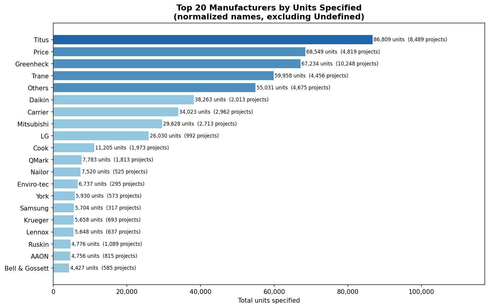
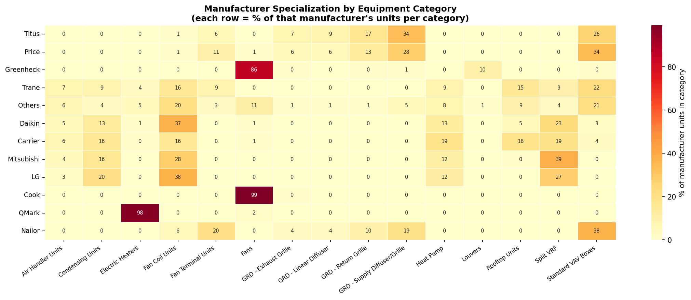
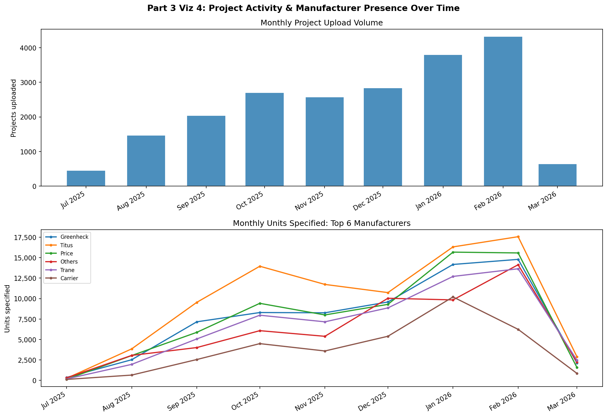

# Rebar DAE Take-Home Case Study


## Overview

This submission analyzes the Rebar construction analytics database (`candidate_database.sqlite`) across three parts: manufacturer entity resolution, project duplicate detection, and exploratory market analysis. All analysis is in `analysis.ipynb`, a single self-contained Jupyter notebook.

---

## Repository Structure

```
Rebar/
    analysis.ipynb          # Main analysis notebook (run this)
    README.md               # This file
    charts/
        part1_normalization_quality.png
        part2_duplicate_detection.png
        part3_viz1_market_share.png
        part3_viz2_category_heatmap.png
        part3_viz3_cooccurrence.png
        part3_viz4_time_trends.png
```

---

## How to Run

Install dependencies and generate the notebook:

```bash
pip install nbformat pandas matplotlib seaborn rapidfuzz
python build_notebook.py   # regenerates analysis.ipynb
```

Then open `analysis.ipynb` in VS Code or Jupyter and run all cells. The database file (`dae-case/candidate_database.sqlite`) must be present in the working directory.

---

## Part 1: Manufacturer Entity Resolution

Evaluates Rebar's first-pass normalization pipeline across 9,680 raw manufacturer name strings, reduced to 510 normalized names.

Key findings:

- 99.4% of raw names were changed by normalization
- Lossy mappings cause real manufacturer names to be mapped to "Undefined" and vice versa, affecting unit counts at business scale
- "Undefined" is the single largest normalized name, accounting for over 20% of all normalized units
- Remaining duplicates in the 510 normalized names include case variants, typos, OCR errors, and generic placeholder words

The section also proposes and implements an improved five-stage entity resolution pipeline using junk filtering, blocking, fuzzy scoring, union-find clustering, and confidence gating.


---

## Part 2: Project Duplicate Detection

Identifies projects representing the same real-world construction job uploaded multiple times due to accidental re-uploads, re-processing, or multi-user submissions.

**Signals scored per candidate pair:**

| Signal | Weight | Rationale |
|---|---|---|
| Fuzzy project name similarity | 0.45 | Strongest single signal |
| Engineer-of-record overlap | 0.20 | Same job means same engineer firm |
| Manufacturer fingerprint overlap | 0.15 | Same plans produce similar equipment lists |
| Sheet count proximity | 0.10 | Same PDF means same page count |
| Equipment count proximity | 0.10 | Same schedules means similar counts |

Pairs are blocked within the same company by name prefix to avoid O(n^2) comparisons. Results are split into an auto-merge tier (score >= 0.80) and a needs-review tier (0.65 to 0.80). Union-find clusters pairs into duplicate groups and a canonical record is selected by most recent upload, then richest extraction.


---

## Part 3: Exploratory Analysis

Four visualizations targeting questions a manufacturer rep would care about, plus a competitive intelligence section using hidden schedule data.

### Viz 1: Market Share

Top 20 manufacturers by total units specified. The market is concentrated at the top, with a small number of brands accounting for a large share of all specified units.



### Viz 2: Category Specialization

Each manufacturer's unit share broken down by equipment category. Greenheck dominates Fans, Titus leads Supply Diffusers, and Mitsubishi is the clear Split VRF specialist. VAV Boxes are a two-brand race between Price and Titus.



### Viz 3: Manufacturer Co-occurrence

How often pairs of manufacturers appear on the same projects. Titus and Greenheck are the most common pairing because they cover complementary product categories and appear together on nearly every large HVAC job. High co-occurrence between direct competitors reveals displacement opportunities.


### Viz 4: Time Trends

Monthly project upload volume alongside unit trends for the top 6 manufacturers. The dataset spans fewer than 12 months, so no seasonal conclusions are drawn. Month-to-month variation closely tracks upload activity rather than true demand shifts.



### Competitor Brands in the Market

Uses hidden schedule data to identify brands that appear disproportionately on jobs the rep does not sell into. These represent direct competitors or expansion targets, ranked by hidden-to-total unit ratio.

---

## Notes

- All analysis uses `is_normalized = 1` data unless stated otherwise.
- 896 projects with empty names are excluded from name-based duplicate blocking to prevent false positives. A production system would run a separate pass on these using only engineer overlap, manufacturer fingerprint, sheet count, and upload proximity signals.
- Unit counts include duplicate projects identified in Part 2. Deduplicating would reduce raw volumes but preserve relative brand rankings.
